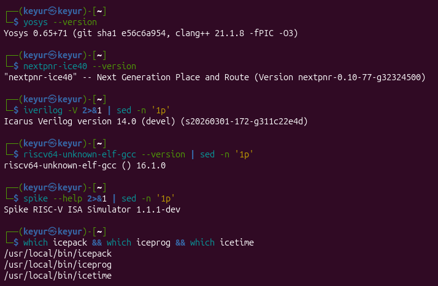

# Task-1 — Environment Setup & RISC-V Reference Bring-Up

Name: Keyur Dobariya

## Objective
Complete environment setup and validate RISC-V execution flow.

## Environment Used  
✅ Ubuntu Local Machine

---

# Local Environment Setup

OS:
Ubuntu 26.04

Tools Installed:

- [yosys](https://github.com/YosysHQ/yosys.git): Converts Verilog code into gate-level logic.
- [nextpnr](https://github.com/YosysHQ/nextpnr.git): Places and routes logic onto specific FPGA hardware.
- [icestorm](https://github.com/YosysHQ/icestorm.git): Generates the final bitstream file for Lattice iCE40 FPGAs.
- [iverilog](https://github.com/steveicarus/iverilog.git): Simulates Verilog code to test and verify hardware design.
- [RISC-V GNU Toolchain](https://github.com/riscv-collab/riscv-gnu-toolchain.git): Compiles C/C++ code into binaries that run on RISC-V processors.
- [spike](https://github.com/riscv-software-src/riscv-isa-sim.git): Simulates a RISC-V processor in software to run and debug binaries.

---

