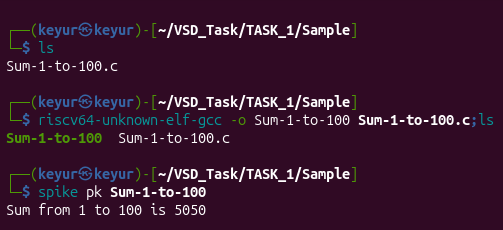

# Sample Run — Sum 1 to 100 (RISC-V)

Name: Keyur Dobariya

## Objective
Verify that the RISC-V toolchain and execution flow are working correctly by compiling and executing a simple C program.

---

# Program Description

This sample program calculates the sum of numbers from **1 to 100**.

Formula:

\[
1 + 2 + 3 + ... + 100
\]

Expected Output:

```text
Sum = 5050
```

---

# Source File

```text
Sum-1-to-100.c
```

---

# Compilation

Compile the program using:

```bash
riscv64-unknown-elf-gcc Sum-1-to-100.c -o Sum-1-to-100
```

---

# Execution

Run using Spike simulator:

```bash
spike pk Sum-1-to-100
```

---

# Output Verification

Execution screenshot:



---

# Result

✅ Toolchain setup successful  
✅ Program compiled successfully  
✅ Program executed successfully  
✅ RISC-V execution flow verified