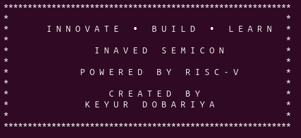
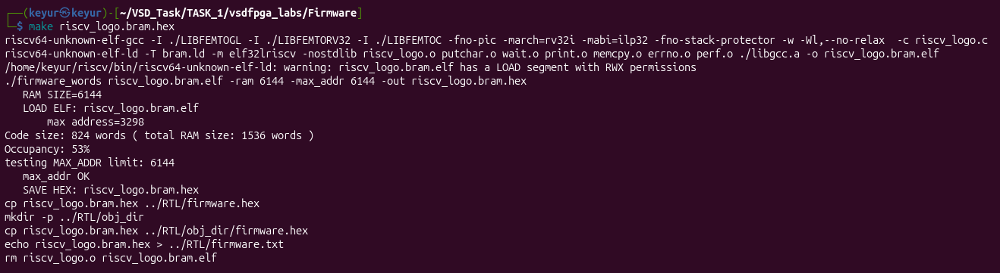
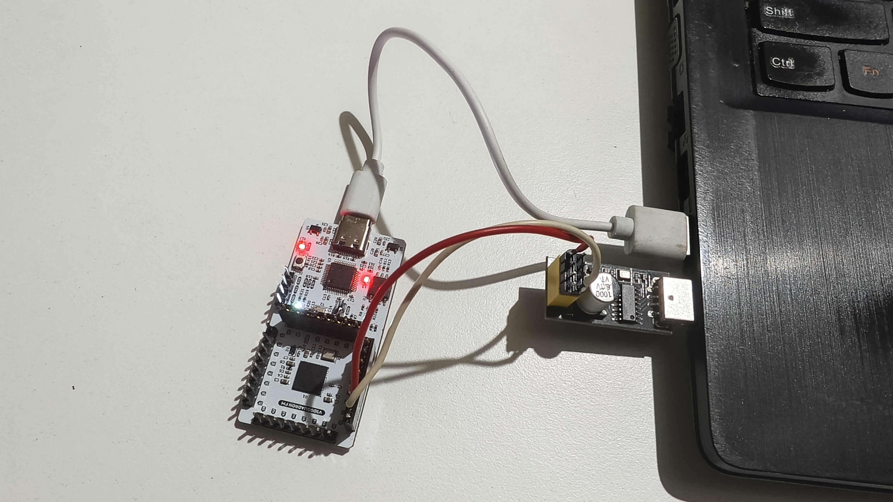

# FPGA Lab — Basic Message Display on RISC-V Core

<div align="center">
  
</div>

---

## Objective

Run the reference RISC-V firmware on the **VSDSquadron FPGA Mini** and receive UART output on the host system through a USB-to-UART converter.

---

## Build
 Change RISC-V logo code :
   ```bash
   cd ~
   git clone https://github.com/vsdip/vsdfpga_labs.git
   cp -r ~/vsdfpga_labs/basicRISCV/* ~/VSD_Task/TASK_1/vsdfpga_labs/
   cd ~/VSD_Task/TASK_1/vsdfpga_labs/Firmware
   nano riscv_logo.c  #Change LOGO in this file
   make riscv_logo.bram.hex
   ```
Output


 Build the firmware and FPGA bitstream:
   ```bash
   cd ../RTL
   make clean
   make build 2>&1 | tee build.log
   ```
 Review [build.log](RTL/build.log)

---

# Hardware Setup

This setup was used to display UART output generated by the RISC-V core running inside the FPGA.

## Connection Diagram

| Source Device | Pin | Destination Device | Pin |
|--------------|-----|--------------------|-----|
| CH340 UART Module | TX | VSDSquadron FPGA Mini | RX (Pin 3) |
| CH340 UART Module | RX | VSDSquadron FPGA Mini | TX (Pin 4) |
| VSDSquadron FPGA Mini | RESET (Pin 23) | VSDSquadron FPGA Mini | GND |

- Connect the FPGA board to one USB port.
- Connect the CH340 module to another USB port.

<div align="center">
  
</div>

---

## Flashing

 Flash to FPGA:
   ```bash
   sudo make flash 2>&1 | tee flash.log
   ```
Review [flash.log](RTL/flash.log)

---

## Running the Lab
 Open the serial terminal:
   ```bash
   make terminal 2>&1 | tee terminal.log
   ```
   **Output**:  
   
   
   
Review [terminal.log](RTL/terminal.log)

Press `Ctrl+A → Ctrl+Q` to exit `picocom`.


---

# Result

 ✅ RISC-V firmware compiled successfully  
 ✅ Bitstream generated successfully  
 ✅ FPGA programmed successfully  
 ✅ UART output received successfully  