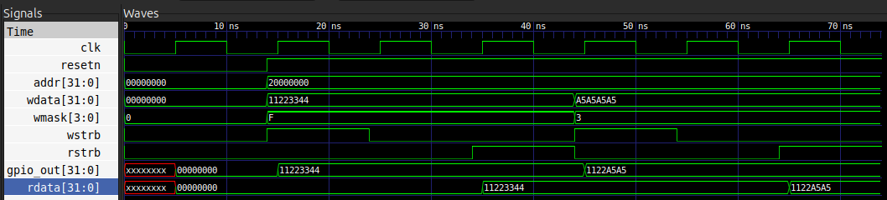
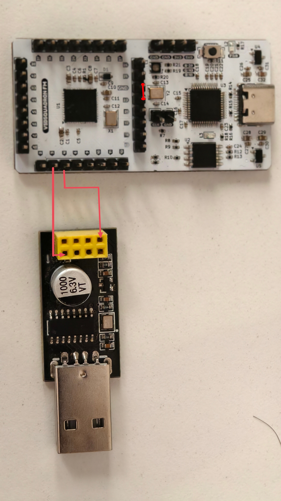
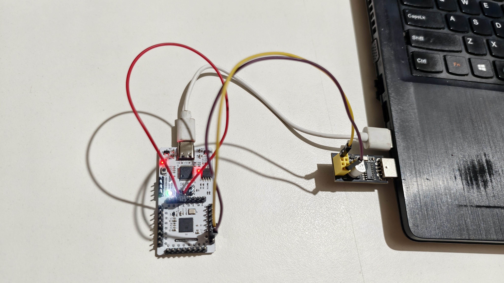
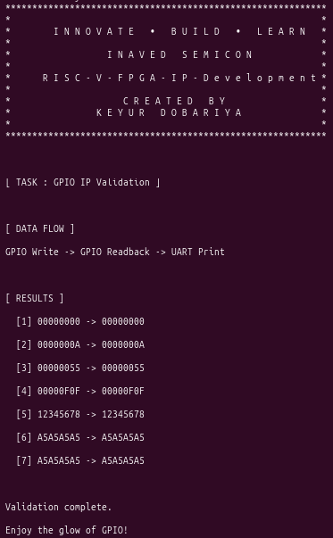

# TASK_2 - GPIO IP Integration and Hardware Validation

This project demonstrates the integration of a custom GPIO IP into the RISC-V FPGA design and validates it on hardware using a simple firmware application.

## Overview

A new custom GPIO IP was added to the RTL design to provide a memory-mapped register interface for writing and reading 32-bit values from the processor.

The GPIO IP is implemented in [RTL/gpio.v](RTL/gpio.v) and is tested using [RTL/gpio_tb.v](RTL/gpio_tb.v).

## New GPIO IP Details

### What was added
- A custom Verilog module named `gpio_ip`
- A memory-mapped interface at base address `0x20000000`
- A 32-bit output register `gpio_out`
- Read/write support through the processor bus interface

### Functional behavior
- When a write operation occurs at the GPIO base address, the value is stored into the internal `gpio_out` register.
- When a read operation occurs, the current stored value is returned on `rdata`.
- The IP supports byte-wise masking through `wmask`, allowing partial writes to the 32-bit register.

### Files related to the GPIO IP
- RTL design: [RTL/gpio.v](RTL/gpio.v)
- Testbench: [RTL/gpio_tb.v](RTL/gpio_tb.v)
- Firmware test program: [Firmware/gpio_test.c](Firmware/gpio_test.c)

## Firmware Test Program

The firmware application in [Firmware/gpio_test.c](Firmware/gpio_test.c) writes a sequence of test values to the GPIO register, reads them back, and prints the results over UART.

This confirms that:
- data can be written to the GPIO IP,
- data can be read back correctly,
- the hardware flow is working end-to-end.

## Waveform Verification

A dedicated testbench is available in [RTL/gpio_tb.v](RTL/gpio_tb.v) to verify GPIO behavior using simulation waveforms.

### How to generate the waveform

Run the following commands from the project root:

```bash
cd ~/RISC-V-FPGA-IP-Development/TASK_2/RTL
iverilog -o gpio_tb gpio_tb.v
vvp gpio_tb
```

This will generate a waveform file named [RTL/gpio_tb.vcd](RTL/gpio_tb.vcd).

### How to view the waveform

Open the waveform using GTKWave:

```bash
gtkwave gpio_tb.vcd
```

### Verification content
The testbench checks:
- a full 32-bit write followed by readback,
- a partial write using byte masking,
- correct register updates and readback values.

You should see the simulation print messages:
- `PASS: full write/readback verified`
- `PASS: partial write/readback verified`

The expected waveform behavior is:
- first write updates the entire 32-bit register to `0x11223344`
- second partial write updates only the lower two bytes, resulting in `0x1122A5A5`

## Build 

The following commands were used successfully to build, flash, and test the design.

```bash
cd Firmware
make clean
make gpio_test.bram.hex 2>&1 | tee ../Logs/firmware.log

cd ../RTL
make build 2>&1 | tee ../Logs/build.log
```

### Command explanation
- `make clean` clears old firmware build outputs.
- `make gpio_test.bram.hex` builds the firmware image and generates the hex file for the FPGA.
- `make build` synthesizes the RTL design and creates the FPGA bitstream artifacts.


## Flash FPGA 
Connect FPGA board at USB port to load bitstream into FPGS board.
```bash
make flash 2>&1 | tee ../Logs/flash.log
```

### Command explanation
- `make flash` programs the generated bitstream into the FPGA board.

## Hardware Setup

This setup was used to display UART output generated by the RISC-V core running inside the FPGA.

### Connection Diagram

| Source Device | Pin | Destination Device | Pin |
|--------------|-----|--------------------|-----|
| CH340 UART Module | TX | VSDSquadron FPGA Mini | RX (Pin 3) |
| CH340 UART Module | RX | VSDSquadron FPGA Mini | TX (Pin 4) |
| VSDSquadron FPGA Mini | RESET (Pin 23) | VSDSquadron FPGA Mini | GND |

<div align="center">
  
</div>

- Connect the FPGA board to one USB port.
- Connect the CH340 module to another USB port.

<div align="center">
  
</div>

## Run 

```bash
make terminal 2>&1 | tee ../Logs/terminal.log
```

### Command explanation
- `make terminal` opens the serial terminal for UART communication.

### Expected Output



## Generated Files and Logs

### Build and runtime logs
- Firmware log: [Logs/firmware.log](Logs/firmware.log)
- FPGA build log: [Logs/build.log](Logs/build.log)
- Flash log: [Logs/flash.log](Logs/flash.log)
- Terminal log: [Logs/terminal.log](Logs/terminal.log)

### Important output files
- Firmware hex: [RTL/firmware.hex](RTL/firmware.hex)
- FPGA bitstream: [RTL/SOC.bin](RTL/SOC.bin)
- FPGA timing file: [RTL/SOC.timings](RTL/SOC.timings)
- FPGA JSON netlist: [RTL/SOC.json](RTL/SOC.json)


## Project File Structure

- [Firmware](Firmware)
- [RTL](RTL)
- [Logs](Logs)
- [Images](Images)

## Result

The custom GPIO IP was successfully added, validated in simulation, and verified on hardware using the firmware program and UART output.
