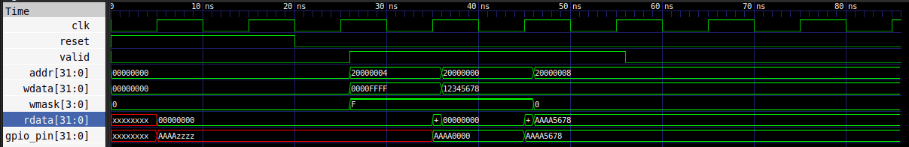
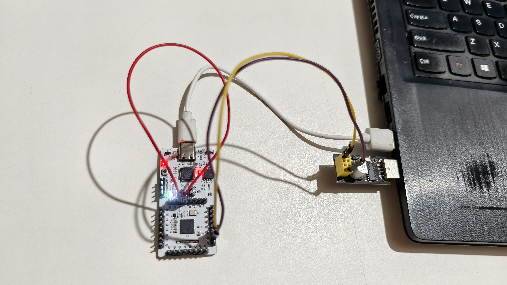

# TASK_3 - Multi-Register GPIO IP with Software Control

This project shows how to upgrade a simple GPIO IP into a realistic, multi-register peripheral. It validates memory-mapped I/O from software to hardware using a C program running on the RISC-V core.

## Overview

The custom GPIO IP was extended to support multiple registers inside one IP block. It uses address decoding so the processor can control pin direction, write data, and read live pin states.

The GPIO IP is implemented in [RTL/gpio.v](RTL/gpio.v) and is tested using [RTL/gpio_tb.v](RTL/gpio_tb.v).

## New GPIO IP Details

### What was added
- An upgraded Verilog module named `gpio_ip` supporting multiple registers.
- A memory-mapped interface at base address `0x20000000`.
- Address decoding for three different registers:
  - `0x00`: `GPIO_DATA` (Output data register)
  - `0x04`: `GPIO_DIR` (Direction register: 1 = output, 0 = input)
  - `0x08`: `GPIO_READ` (Readback register)
- `inout` pins to support both input and output hardware signals.

### Functional behavior
- **GPIO_DIR:** Writing a `1` makes the pin an output. Writing a `0` makes it an input (high-impedance).
- **GPIO_DATA:** Stores the output values. Writing updates the pins (if set as output). Reading returns the last written value.
- **GPIO_READ:** Returns the actual live state of the GPIO pins.

### Files related to the GPIO IP
- RTL design: [RTL/gpio.v](RTL/gpio.v)
- Testbench: [RTL/gpio_tb.v](RTL/gpio_tb.v)
- Firmware test program: [Firmware/gpio_test.c](Firmware/gpio_test.c)

## Firmware Test Program

The firmware application in [Firmware/gpio_test.c](Firmware/gpio_test.c) does the following steps to test the hardware:
1. Sets the lower 16 bits to outputs and the upper 16 bits to inputs by writing `0x0000FFFF` to `GPIO_DIR`.
2. Writes a test value `0x12345678` to `GPIO_DATA`.
3. Reads the live pin states from `GPIO_READ`.
4. Prints the results over UART using standard `printf`.

## Waveform Verification

A testbench is available in [RTL/gpio_tb.v](RTL/gpio_tb.v) to verify the GPIO works correctly using simulation waveforms. It simulates external hardware driving the upper 16 bits with `0xAAAA`.

### How to generate the waveform
Run the following commands from the project root:
```bash
cd ~/RISC-V-FPGA-IP-Development/TASK_3/RTL
iverilog -o gpio_tb gpio_tb.v
vvp gpio_tb
```

### Verification content

The testbench checks:

- A write to the direction register
- A write to the data register
- Correct readback values from the physical pins

You should see the simulation print message:

    `PASS: Readback verified! Value is aaaa5678`
This will make a waveform file named `gpio_tb.vcd`.
How to view the waveform

Open the waveform using GTKWave:
```Bash
gtkwave gpio_tb.vcd
```


##  Build

The following commands were used to build, flash, and test the design.
```Bash
cd Firmware
make clean
make gpio_test.bram.hex 2>&1 | tee ../Logs/firmware.log
cd ../RTL
make build 2>&1 | tee ../Logs/build.log
```

Command explanation

- `make clean` clears old firmware build files.
- `make gpio_test.bram.hex` builds the firmware image and makes the hex file for the FPGA.
- `make build` synthesizes the RTL design and makes the FPGA bitstream files.

## Flash FPGA

Connect the FPGA board to a USB port to load the bitstream into the FPGA board.
```Bash
make flash 2>&1 | tee ../Logs/flash.log
```
Command explanation

- `make flash` programs the generated bitstream into the FPGA board.

## Hardware Setup

This setup was used to display UART output generated by the RISC-V core running inside the FPGA.

### Connection Diagram

| Source Device | Pin | Destination Device | Pin |
|--------------|-----|--------------------|-----|
| CH340 UART Module | TX | VSDSquadron FPGA Mini | RX (Pin 3) |
| CH340 UART Module | RX | VSDSquadron FPGA Mini | TX (Pin 4) |
| VSDSquadron FPGA Mini | RESET (Pin 23) | VSDSquadron FPGA Mini | GND |

<div align="center">
  
</div>

- Connect the FPGA board to one USB port.
- Connect the CH340 module to another USB port.

<div align="center">
  
</div>

## Run 

```bash
make terminal 2>&1 | tee ../Logs/terminal.log
```

### Command explanation
- `make terminal` opens the serial terminal for UART communication.

### Expected Output

```bash
Starting Task 3 GPIO Test...
Direction set to 0x0000FFFF
Wrote 0x12345678 to GPIO_DATA
Read value from GPIO_READ: 0x12345678
Test Complete.
```

## Generated Files and Logs

### Build and runtime logs
- Firmware log: [Logs/firmware.log](Logs/firmware.log)
- FPGA build log: [Logs/build.log](Logs/build.log)
- Flash log: [Logs/flash.log](Logs/flash.log)
- Terminal log: [Logs/terminal.log](Logs/terminal.log)

### Important output files
- Firmware hex: [RTL/firmware.hex](RTL/firmware.hex)
- FPGA bitstream: [RTL/SOC.bin](RTL/SOC.bin)
- FPGA timing file: [RTL/SOC.timings](RTL/SOC.timings)
- FPGA JSON netlist: [RTL/SOC.json](RTL/SOC.json)


## Project File Structure

- [Firmware](Firmware)
- [RTL](RTL)
- [Logs](Logs)
- [Images](Images)

## Result

The custom GPIO IP was successfully added, validated in simulation, and verified on hardware using the firmware program and UART output.
