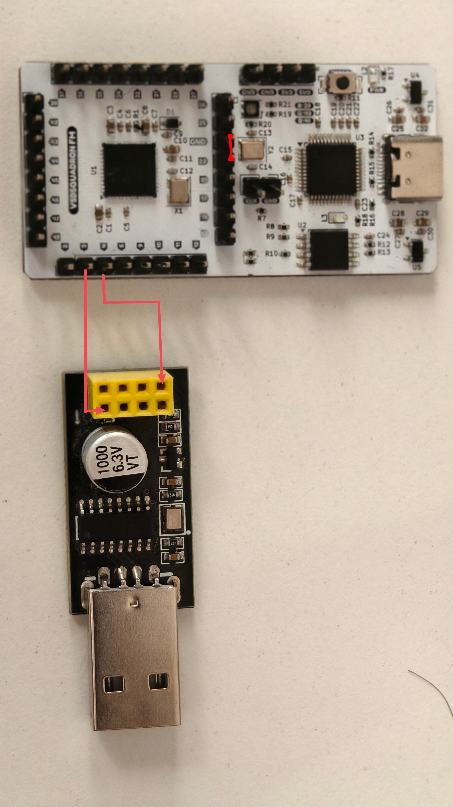

# TASK_4 - Real Peripheral IP Development: PWM IP

This project implements a **single-channel PWM (Pulse Width Modulation) IP** as a memory-mapped peripheral inside the VSDSquadron FPGA Mini RISC-V SoC. The IP is fully register-controllable from C code running on the RISC-V core and drives the on-board LED with a smooth fading effect for hardware validation.

## Overview

A custom Verilog IP named `pwm_ip` was designed and integrated into the SoC as a new memory-mapped peripheral at base address `0x30000000`. The IP exposes a **CTRL / PERIOD / DUTY / STATUS** register set that matches the Task-4 PWM specification, and its `pwm_out` signal is routed to on-board **LED0** so that duty-cycle changes are directly visible.

The PWM IP is implemented in [RTL/pwm.v](RTL/pwm.v) and verified with the testbench [RTL/pwm_tb.v](RTL/pwm_tb.v). Firmware in [Firmware/pwm_test.c](Firmware/pwm_test.c) programs the IP and continuously sweeps the duty cycle to fade LED0.

## New PWM IP Details

### What was added
- A custom Verilog module `pwm_ip` implementing a single-channel PWM generator.
- A memory-mapped interface at base address `0x30000000`.
- Address decoding for four 32-bit word-aligned registers:
  - `0x00`: `CTRL` &nbsp;&nbsp;— `bit0` = EN, `bit1` = POL
  - `0x04`: `PERIOD` — PWM period in clock ticks (≥ 1)
  - `0x08`: `DUTY` &nbsp;&nbsp;— High time in clock ticks
  - `0x0C`: `STATUS` — Debug (bit0 = RUNNING, `[31:16]` = current counter)
- A free-running counter `0 .. PERIOD-1` with clean reset behavior.
- Synchronous, byte-strobed writes (`wmask`) and combinational reads.
- SoC-level integration inside [RTL/riscv.v](RTL/riscv.v):
  - Address decode `isPWM = (mem_addr[31:28] == 4'h3)`
  - `pwm_out` muxed onto **LEDS[0]** so LED0 shows PWM brightness

### Functional behavior
- **CTRL.EN = 1** enables the PWM output. When `EN = 0`, `pwm_out` is forced to the polarity-selected inactive level.
- **PERIOD** selects the PWM period in system-clock ticks. With a 12 MHz clock and `PERIOD = 1024`, the PWM frequency is about **11.7 kHz** — well above visible flicker.
- **DUTY** selects the number of ticks per period that `pwm_out` is at the active level:
  - `DUTY = 0` → always inactive
  - `DUTY ≥ PERIOD` → always active
  - otherwise → active for `DUTY` ticks, inactive for `PERIOD − DUTY` ticks.
- **CTRL.POL = 1** inverts the output polarity.

### Files related to the PWM IP
- RTL design: [RTL/pwm.v](RTL/pwm.v)
- SoC integration: [RTL/riscv.v](RTL/riscv.v)
- Testbench: [RTL/pwm_tb.v](RTL/pwm_tb.v)
- Firmware test program: [Firmware/pwm_test.c](Firmware/pwm_test.c)

## Firmware Test Program

The firmware application [Firmware/pwm_test.c](Firmware/pwm_test.c) performs the following steps:
1. Sets `PWM_PERIOD` to `1024` ticks (≈ 11.7 kHz PWM at a 12 MHz system clock).
2. Sets `PWM_DUTY` to `0` and enables the PWM (`PWM_CTRL = EN`).
3. Reads the registers back and prints their values over UART for confirmation.
4. Enters an infinite loop that sweeps `PWM_DUTY` from `0` to `PERIOD` and back, producing a smooth **fade-up / fade-down** effect on LED0.

The firmware confirms end-to-end operation of the SoC bus, the IP register file, the PWM counter, and the LED output.

## Waveform Verification

A dedicated testbench [RTL/pwm_tb.v](RTL/pwm_tb.v) drives the PWM IP over its bus interface and measures the resulting waveform.

### How to generate the waveform

Run the following commands from the project root:

```bash
cd ~/RISC-V-FPGA-IP-Development/TASK_4/RTL
iverilog -o pwm_tb pwm_tb.v
vvp pwm_tb
```

This will create the waveform file [RTL/pwm_tb.vcd](RTL/pwm_tb.vcd).

### How to view the waveform

Open the waveform in GTKWave:

```bash
gtkwave pwm_tb.vcd
```


### Verification content

The testbench checks:

- **Duty ratio** with `PERIOD = 10, DUTY = 3` → `pwm_out` is high for 3/10 cycles.
- **Runtime duty update** to `DUTY = 7` → `pwm_out` is high for 7/10 cycles.
- **Polarity inversion** with `POL = 1, DUTY = 7` → `pwm_out` is high for 3/10 cycles.
- **Disable behavior** with `EN = 0` → `pwm_out` is driven to the inactive level (low if `POL = 0`, high if `POL = 1`).

You should see the simulation print:

```
PASS: Duty ratio verified (3/10 = 30%).
PASS: Duty update verified (7/10 = 70%).
PASS: Polarity inversion verified.
PASS: EN=0 with POL=1 forces output high (inactive).
PASS: EN=0 with POL=0 forces output low (inactive).
```

## Build

The following commands build the firmware and the FPGA bitstream:

```bash
cd Firmware
make clean
make pwm_test.bram.hex 2>&1 | tee ../Logs/firmware.log

cd ../RTL
make build 2>&1 | tee ../Logs/build.log
```

### Command explanation
- `make clean` clears old firmware build files.
- `make pwm_test.bram.hex` compiles the firmware and produces the hex image loaded into the FPGA BRAM.
- `make build` synthesizes the RTL (Yosys → nextpnr-ice40 → icetime → icepack) and produces the FPGA bitstream.

## Flash FPGA

Connect the FPGA board to a USB port to load the bitstream.

```bash
make flash 2>&1 | tee ../Logs/flash.log
```

### Command explanation
- `make flash` programs the generated bitstream into the FPGA via `iceprog`.

## Hardware Setup

The same UART setup used in TASK_2 / TASK_3 is used here to observe firmware print messages.

### Connection Diagram

| Source Device | Pin | Destination Device | Pin |
|---------------|-----|--------------------|-----|
| CH340 UART Module | TX | VSDSquadron FPGA Mini | RX (Pin 3) |
| CH340 UART Module | RX | VSDSquadron FPGA Mini | TX (Pin 4) |
| VSDSquadron FPGA Mini | RESET (Pin 23) | VSDSquadron FPGA Mini | GND |

<div align="center">
  
</div>

- Connect the FPGA board to one USB port.
- Connect the CH340 module to another USB port.

<div align="center">
  
</div>

**Board LED demo:** `pwm_out` is muxed onto **LEDS[0]** inside the SoC. When the firmware sweeps `PWM_DUTY`, LED0 visibly fades up and down — no external wiring required.

## Run

```bash
make terminal 2>&1 | tee ../Logs/terminal.log
```

### Command explanation
- `make terminal` opens a serial terminal (`picocom`) at 9600 baud for UART output.

### Expected Output

```text
Task 4 - PWM IP Test
PWM_BASE = 0x30000000
Configured: PERIOD=1024 DUTY=0 CTRL=0x1
Fading LED0 up and down. Watch the on-board LED.
Cycle done. DUTY back to 0.
Cycle done. DUTY back to 0.
...
```

<video src="[user-images.githubusercontent.com](https://github.com/user-attachments/assets/ca6744f9-1d6d-4702-b0ca-6e4031e95a63)" controls width="500"></video> 

Simultaneously, **LED0 fades smoothly up and down** on the VSDSquadron FPGA Mini board.

## Generated Files and Logs

### Build and runtime logs
- Firmware log: [Logs/firmware.log](Logs/firmware.log)
- FPGA build log: [Logs/build.log](Logs/build.log)
- Simulation log: [Logs/simulation.log](Logs/simulation.log)
- Flash log: [Logs/flash.log](Logs/flash.log)
- Terminal log: [Logs/terminal.log](Logs/terminal.log)

### Important output files
- Firmware hex: [RTL/firmware.hex](RTL/firmware.hex)
- FPGA bitstream: [RTL/SOC.bin](RTL/SOC.bin)
- FPGA timing file: [RTL/SOC.timings](RTL/SOC.timings)
- FPGA JSON netlist: [RTL/SOC.json](RTL/SOC.json)

## Project File Structure

- [Firmware](Firmware)
- [RTL](RTL)
- [Logs](Logs)
- [Images](Images)

## Result

The custom PWM IP was successfully designed, integrated into the RISC-V SoC, and validated in both simulation and hardware:

- **Simulation:** all four functional checks (duty, duty-update, polarity, disable) pass.
- **Synthesis:** clean build on iCE40UP5K via Yosys + nextpnr-ice40 + icestorm (no errors, no unused/undriven signals).
- **Hardware:** LED0 on the VSDSquadron FPGA Mini fades up and down under software control, confirming end-to-end operation of the CPU bus, address decoder, PWM IP, and pin output.
